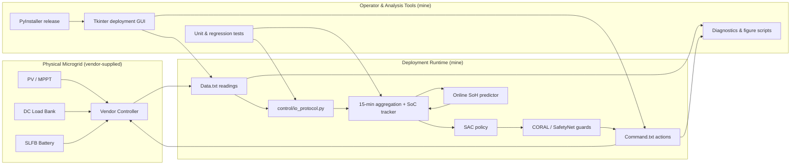

# Deployment-Safe RL for Microgrid Energy Management

**Taking a reinforcement-learning controller from simulation onto a live physical
battery microgrid — with a safety layer that keeps the hardware from ever
executing an unsafe action.**

Most RL energy-management demos stop at a clean simulator. This project is about
the hard part that comes after: making a learned policy survive contact with real
hardware — drifting state estimates, frozen or delayed sensors, firmware quirks,
asymmetric battery limits, and action semantics that differ from the idealized
training environment — while never violating physical safety limits.

The controller pairs a SAC policy with **CORAL**, a deployment-safety layer
(conformal risk corridor + action projection + opportunity-cost shaping) that
projects unsafe actions back into a feasible region before they reach the
battery. The repository contains the full stack I built around it: the training
and simulation environment, the real-time deployment runtime that talks to
vendor hardware, an operator GUI, packaging, and a reproducible evaluation
pipeline.

> **Publication:** H. Y. Wen and H. Y. Chen, “Deployment-Safe Reinforcement
> Learning Agent for Microgrid Energy Management via Conformal Prediction and
> Opportunity-Cost Awareness,” oral presentation, The 249th ECS Meeting,
> Seattle, USA, 2026.

---

## What this project demonstrates (for engineers)

- **Sim-to-real control** — a policy trained in simulation, then deployed on a
  physical microgrid through a real-time control loop, with the gap explicitly
  engineered away rather than assumed away.
- **Safety-critical decision-making** — a guard layer that provably bounds the
  system (State-of-Charge stays inside physical limits) regardless of what the
  learned policy proposes.
- **Robustness to real-world faults** — guards for voltage cutoff, isolated
  load-bus behaviour, firmware/current inconsistencies, and frozen sensor data.
- **Reproducible evaluation** — deterministic seeds, fixed decision cadence,
  paired A/B experiments, and full ablations across methods and scenarios.
- **Shipping, not just notebooks** — file-based hardware I/O protocol, a Tkinter
  operator GUI, and a one-command PyInstaller Windows build.
- **Engineering judgment** — I found and fixed a physics bug in the simulator,
  then designed a controlled experiment to *prove* the fix was correct and
  side-effect-free (see [Engineering rigor](#engineering-rigor-a-bug-hunt-worth-reading)).

## Highlights

- The **CORAL / SafetyNet guard layer eliminated strict State-of-Charge band
  violations** for the learned controllers in the flow-control scenarios, while
  keeping operating economics comparable to the unguarded policies.
- After a physical-floor correction, **State-of-Charge is guaranteed ≥ 0 for
  every method**, and per-step limit excursions are bounded by the battery’s
  physical headroom — verified directly from step-level logs.
- Unguarded baselines (raw SAC, PPO) that looked fine in aggregate were shown to
  drive the battery into physically impossible states without the safety layer —
  a concrete demonstration of *why* the guard matters.

---

## System architecture



The runtime executes on 15-minute decision windows and communicates with the
vendor controller through a simple `Data.txt` / `Command.txt` file protocol, so
the learned controller can be dropped in front of hardware that was never
designed for RL.

---

## Engineering deep-dives

### The CORAL deployment-safety layer

CORAL keeps an RL controller deployable under uncertain battery state. It uses
recent prediction residuals to build a **conformal risk corridor** around the
SoC trajectory, **projects unsafe actions** back into a feasible region before
they reach the hardware, and turns each safety correction into an **opportunity
cost** so the policy learns to avoid risky states in the first place. This means
the safety guarantee holds at deployment even for a policy that was never
perfectly safe on its own.

### Hardware-aligned simulation environment

A Gymnasium environment that deliberately models the messy parts of real
deployment: asymmetric charge/discharge limits, battery-only discharge
semantics, PV-first load supply, time-of-use pricing, voltage-cutoff behaviour,
and an optional 2-D `[power, flow_rate]` action space for flow-battery pump
control. Training against these constraints is what makes the sim-to-real
transfer actually work.

### Robust real-time deployment

The deployment loop is built to fail safe, not to assume clean inputs. It guards
against voltage cutoff, isolated load-bus conditions, firmware-vs-calculated SoC
disagreement, and frozen/stale sensor readings, and it reconciles Coulomb-counting
SoC with voltage-based correction. An online State-of-Health predictor adjusts
effective capacity over time.

### Engineering rigor: a bug hunt worth reading

While validating results I noticed the flow-control scenarios reported battery
“violation energy” larger than the entire battery capacity — a physical
impossibility. Tracing it through the environment, the simulator was **not
clipping SoC at its physical floor**, so an aggressive policy could discharge the
battery into a negative, non-physical state while the observation was silently
clamped to `[0, 1]`.

Rather than just patch the number, I:

1. Added a hard physical SoC floor that **truncates discharge to the energy
   actually available** and routes the unmet load to the grid with correct cost
   accounting.
2. Re-ran a **paired A/B experiment** (floor-off vs floor-on) under an identical
   harness — same seeds, checkpoints, decision cadence, and evaluation horizon —
   so the only variable was the fix.
3. Added an **invariance check** proving that well-behaved methods were
   *bit-for-bit identical* before and after the change, and verified SoC ≥ 0 for
   every method directly from step-level logs.

This is the kind of debugging, controlled experimentation, and regression-proofing
I bring to production systems.

---

## Tech stack

Python · PyTorch (SAC) · Stable-Baselines3 (PPO) · Gymnasium · NumPy / pandas ·
Matplotlib · Tkinter (operator GUI) · PyInstaller (Windows packaging) · pytest.

## Repository layout

```text
configs/       Quick-start, experiment, deployment, and baseline configs
control/       Real-time deployment loop and hardware I/O protocol
core/          RL agents, microgrid environment, safety layers, SoH predictor
data/scripts/  Preprocessing, diagnostics, figures, and baseline utilities
docs/          Research notes and experiment protocols
examples/      Standalone example microgrid environments
gui/           Tkinter deployment GUI
packaging/     PyInstaller build specification
tests/         Unit and regression tests
tools/         Portable handoff and analysis tools
```

## Quick start

新接手者請先讀繁中「我要做什麼」入口：
[`docs/HANDOVER_zh.md`](docs/HANDOVER_zh.md)。
AI／自動化維護者請先讀 [`AGENTS.md`](AGENTS.md)。

```bash
pip install -r requirements.txt      # install dependencies
pytest                               # run the test suite

# Train a controller
python core/train_sac_microgrid.py --config configs/config_p302_sim.yaml

# Run deployment (development mode)
python control/run_deployment.py ^
  --data-file path/to/Data.txt ^
  --command-file path/to/Command.txt ^
  --model-path path/to/best_sac_model.pth ^
  --battery-pp 01

# Build the Windows GUI package
powershell -ExecutionPolicy Bypass -File .\_deploy.ps1
```

Historical P302 experiment configs live under `configs/experiments/p302/`;
baseline and ablation configs under `configs/baselines/`. For hardware setup,
GUI packaging, and operational checks, see
[`docs/deployment_guide.md`](docs/deployment_guide.md).

## My role

I designed and built the **entire software stack solo** — the RL training
pipeline, the CORAL safety layer, the real-time deployment runtime, the operator
GUI, the Windows packaging, and the reproducible evaluation pipeline —
integrating against **vendor-supplied microgrid hardware**.

## Data and model artifacts

Large raw logs, trained checkpoints, packaged executables, and third-party
reference material are intentionally excluded from version control to keep the
repository focused on source, configuration, and reproducible scripts. Scripts
expect logs and weights at the local paths described in their configuration.

This public snapshot does not include `data/processed/`, experiment outputs,
RL/SoH model weights, vendor P302 software, or packaged GUI releases. Prepare or
obtain those artifacts separately before training, SoH inference, or hardware
deployment.
